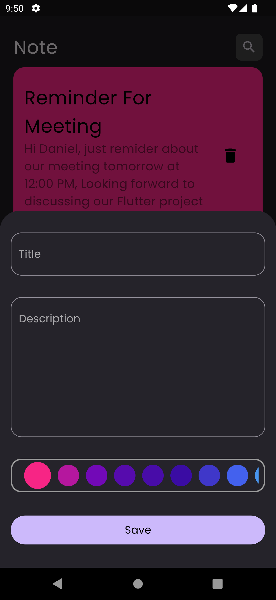
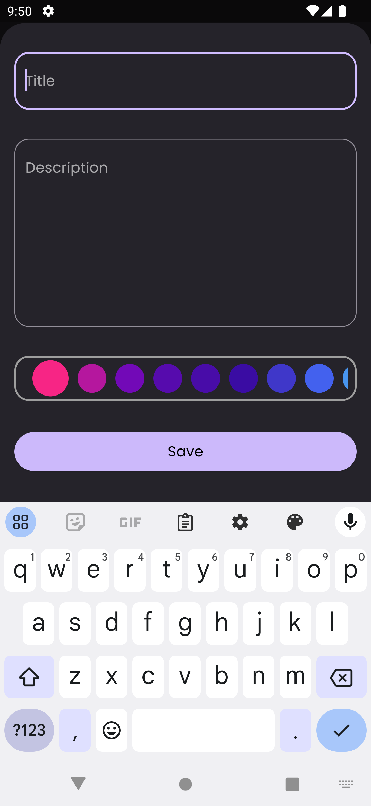
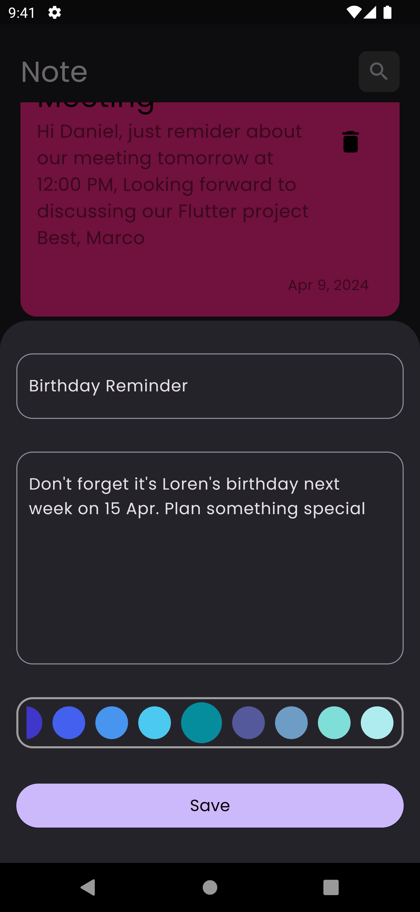
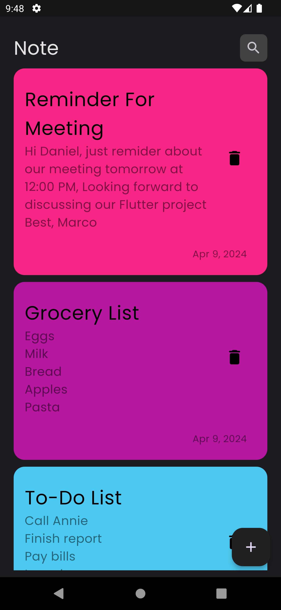
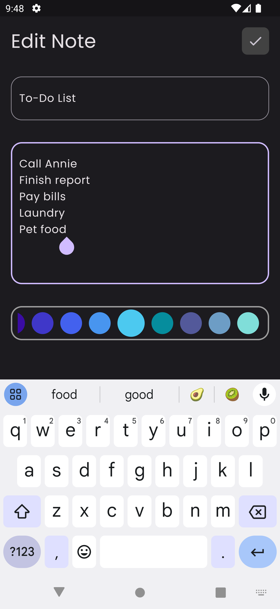

# Notes App

[](https://flutter.dev/)

## Overview

The Notes app allows users to create, edit, and manage notes. The app features a main screen where users can add new notes using a floating action button. Each note includes a title, description, and a color chosen by the user. Notes are saved and displayed on the main screen based on their creation time. Users can also delete notes from the main screen and edit them by navigating to a dedicated screen.

## Features

- **Main Screen**:

  - Floating action button to open a bottom sheet for adding new notes.
  - Bottom sheet includes fields for title, description, color selection, and a save button.
  - List of saved notes displayed based on their creation time.
  - Delete button for removing notes.

- **Edit Screen**:
  - Allows users to edit the title, description, and color of an existing note.
  - Submit button to save changes.

## State Management

The app uses [Cubit](https://pub.dev/packages/cubit) for state management, providing a simple and efficient way to manage the state of the app.

## Data Storage

Notes are stored using [Hive](https://pub.dev/packages/hive), a lightweight and fast NoSQL database for Flutter.

## Date and Time Management

The `intl` package is used to manage and format dates and times, ensuring notes are arranged based on the latest creation or modification time.

## Dependencies

- `flutter`: ^latest
- `cupertino_icons`: ^1.0.2
- `hive`: ^2.2.3
- `hive_flutter`: ^1.1.0
- `flutter_bloc`: ^8.1.5
- `bloc`: ^8.1.4
- `meta`: ^1.10.0
- `modal_progress_hud_nsn`: ^0.5.1
- `intl`: ^0.19.0

## Screenshots

<div style="display: flex; flex-wrap: wrap;">
    <div style="margin: 10px;">
        <p>Home Screen</p>
        
        
        
        
    </div>
    <div style="margin: 10px;">
        <p>Edit Screen</p>
        
    </div>
</div>

## Getting Started

To get a local copy of the project up and running, follow these steps:

1. **Clone the repository**

   ```bash
   git clone https://github.com/marcolous/Flutter-Notes.git
   ```

2. Navigate to the project directory:
   ```bash
   cd ChatApp
   ```
3. Install the dependencies:
   ```bash
   flutter pub get
   ```
4. Run the app:
   ```bash
   flutter run
   ```

## Usage

### Adding a Note

- Click the floating action button on the main screen.
- Enter the title, description, and choose a color in the bottom sheet.
- Tap the save button to add the note.

### Editing a Note

- Tap on a note to navigate to the edit screen.
- Modify the title, description, or color as needed.
- Tap the submit button to save changes.

### Deleting a Note

- Swipe or click the delete button on a note to remove it from the main screen.

## Contributing

If you have suggestions for improvements or bug fixes, please open an issue or submit a pull request.

## License

This project is licensed under the MIT License - see the [LICENSE](LICENSE) file for details.

## Contact

If you have any questions or feedback, feel free to reach out to me at [louismarco226@gmail.com](mailto:louismarco226@gmail.com).
